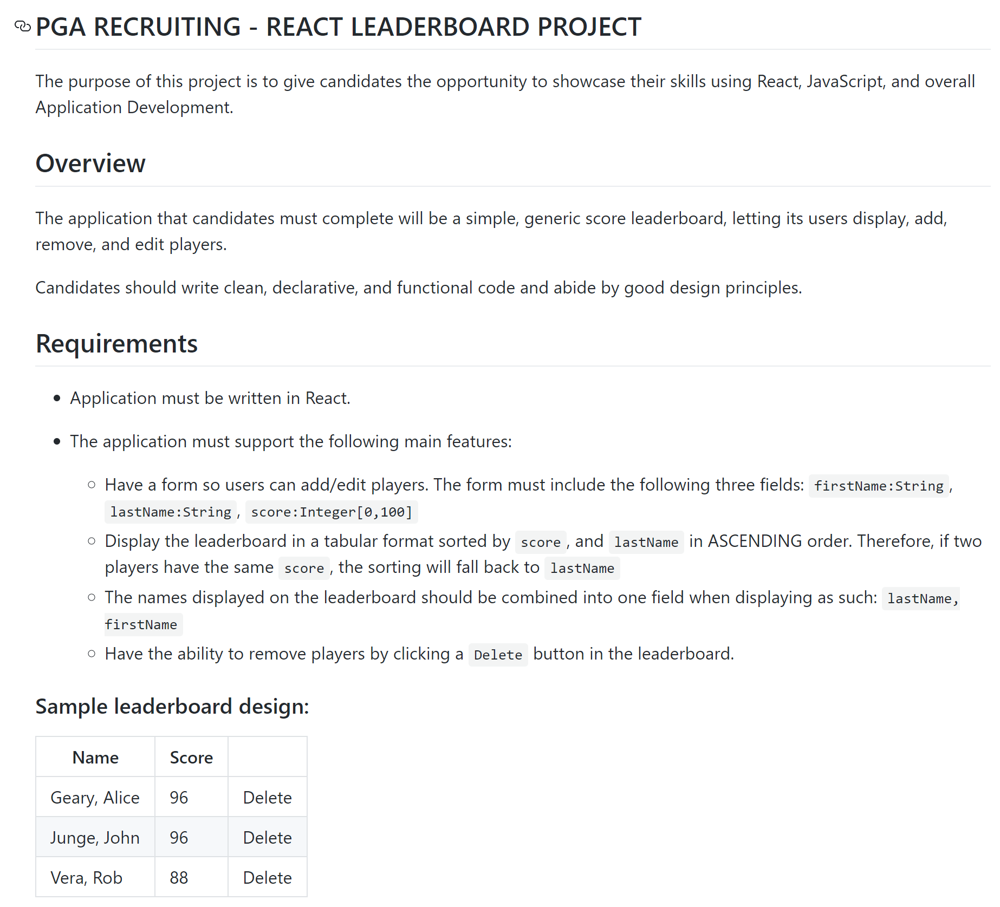

# PGA Tour - Interview Application

[Go to live application](http://pga.pirated.technology)

##### Desktop View

##### Mobile View

__I am not a designer, but I did try__

## Some Key Points
- Application was deliberately built using *ONLY Functional Components* with React Hooks (Meaning, zero class-based components were used)
- "Score" is the value that is sorted in ASCENDING (lowest to highest).
  - There is also a "Total" column. That was extra. That's the player's "Par Total"
    - Par was set to 70. 
    - Par Total is simply calculated.
  - When two players have the same "Score", they are subsorted by last name ASCENDING (a first, z last), case-insensitive
- The "Score" circles are color coded. Green is a good "Score", red is a horrible "Score". (green, yellow, orange, red)
- Some players are *seeded* (the list is preopulated with some fake data)
- I simply found that logo and background image in a google images search
- The form in the left *Sidebar* is used to add new players.
  - I was tempted to make the pencil icon just populate that same form with existing player data.
  - Instead, clicking the pencil icon creates a new (inline) form, which allows you to edit in place.
- My use of the Context API was unecessary, but given that this is an interview I felt obligated to fit it in somewhere.
- I hosted it in an AWS S3 bucket with a DNS CName that points to the bucket. 
  - I did not buy an TLS certificate. (Only HTTP)

## Finally

- I was extremely tempted to use Material-UI or Bootstrap to speed this up. Since this is an interview, I decided to use nothing and build everything from scratch.
- I even used my own Webpack build system rather than create-react-app.
- I did load: FontAwesome Icons and 1 Google Font

---

#### The original Project Requirements are below:

---
